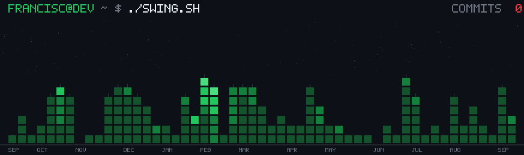
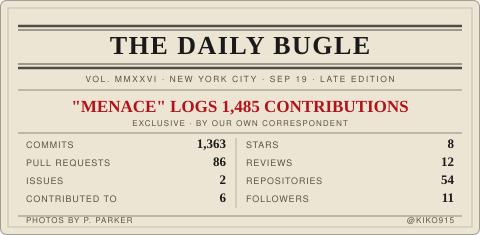
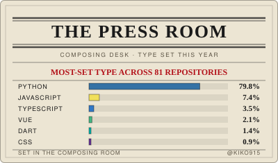
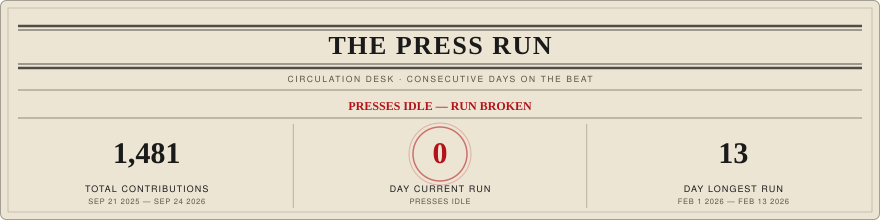

<div align="center">

<!-- Terminal-style typing animation as the hero -->


<br/>

<!-- Social badges — flat style to stay minimal -->
<p>
  
  &nbsp;
  <a href="https://instagram.com/francis.mistica">
    
  </a>
  &nbsp;
  <a href="mailto:developwithfrancisco@gmail.com">
    
  </a>
  &nbsp;
  <a href="https://francismistica.me">
    
  </a>
</p>

</div>

```bash
# ────────────────────────────────────────────────
#  francisc@dev  ~  ./swing.sh
# ────────────────────────────────────────────────

$ ./swing.sh --city contributions
  → every week is a tower, height = days I shipped
  → brightest block = my best day of the week
  → the swing arc rides my own skyline
```

<p align="center">
  
</p>

---

```bash
# ────────────────────────────────────────────────
#  francisc@dev  ~  about.sh
# ────────────────────────────────────────────────

$ cat about.json
{
  "name"     : "Francis Mistica",
  "role"     : "Fullstack Developer",
  "location" : "Philippines 🇵🇭",
  "focus"    : ["React", "Next.js", "TypeScript", "Node.js"],
  "learning" : "Next.js · System Design",
  "building" : "Yow-Work  →  https://yowwork.netlify.app",
  "fun_fact" : "Because of the gravity."
}
```

---

```bash
# ────────────────────────────────────────────────
#  francisc@dev  ~  stack --list
# ────────────────────────────────────────────────

$ ls ./frontend/
```

<div align="center">


</div>

```bash
$ ls ./backend/
```

<div align="center">


</div>

```bash
$ ls ./tools/
```

<div align="center">


</div>

---

```bash
# ────────────────────────────────────────────────
#  francisc@dev  ~  github --stats kiko915
# ────────────────────────────────────────────────
```

<div align="center">


&nbsp;


<br/><br/>



<br/><br/>


</div>

---

```bash
# ────────────────────────────────────────────────
#  francisc@dev  ~  ls ./projects/active/
# ────────────────────────────────────────────────

$ open yow-work/
  → https://yowwork.netlify.app       [LIVE 🟢]

$ open portfolio/
  → https://francismistica.me         [LIVE 🟢]

$ echo "Let's build something."
  → developwithfrancisco@gmail.com
```
